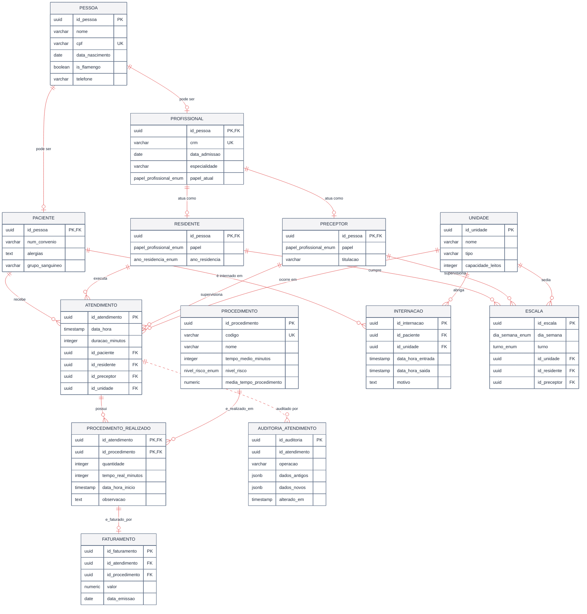

---

## Notas da Etapa 2

O diagrama acima já reflete as adições da Etapa 2:

- **`ATENDIMENTO.id_unidade`** — a unidade onde o atendimento ocorreu (a Etapa 1 não amarrava atendimento a unidade). Alimenta `vw_estatisticas_atendimentos_mensal`.
- **`PROCEDIMENTO_REALIZADO.data_hora_inicio`** — horário real de início do procedimento; base do cálculo de `sp_calcular_tempo_medio_espera`.
- **`PROCEDIMENTO.media_tempo_procedimento`** — mantida automaticamente pelo trigger `trg_atualiza_media_procedimentos`.
- **`INTERNACAO`** — entidade nova; `data_hora_saida IS NULL` marca paciente ainda internado. Base de `vw_pacientes_internados`.
- **`AUDITORIA_ATENDIMENTO`** — log escrito pelo trigger `trg_audita_atendimento` (INSERT/UPDATE/DELETE em `ATENDIMENTO`), sem FK de propósito.

Detalhamento em [`../04-banco/04-procedures.md`](../04-banco/04-procedures.md), [`05-views.md`](../04-banco/05-views.md) e [`06-triggers.md`](../04-banco/06-triggers.md).
